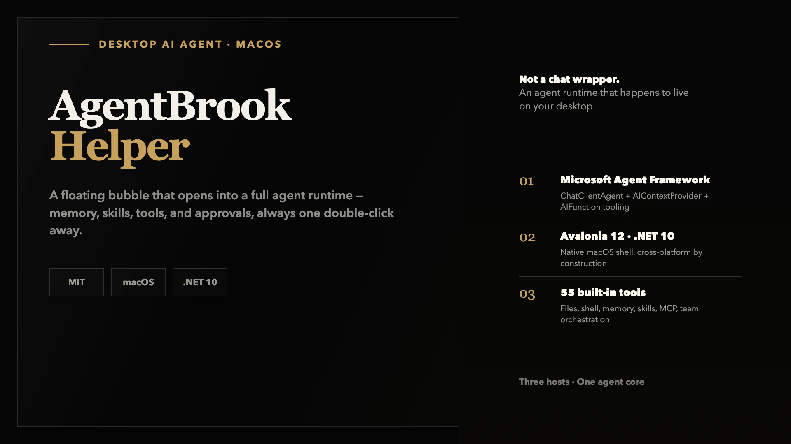
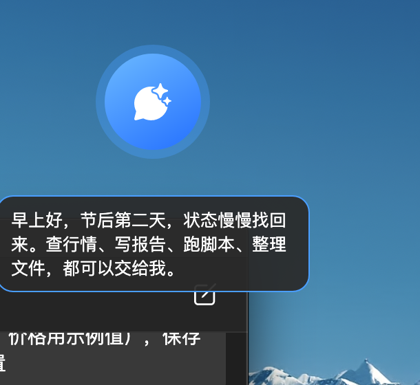
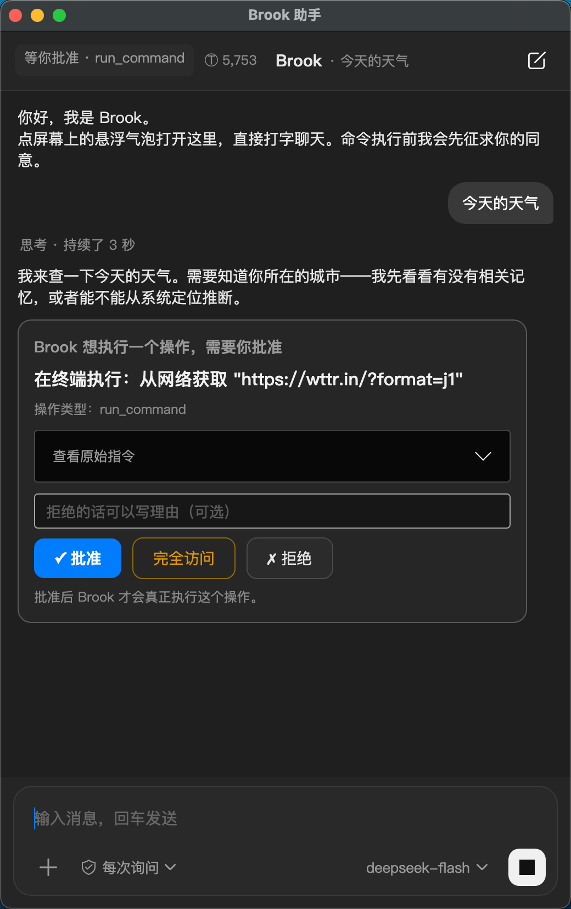
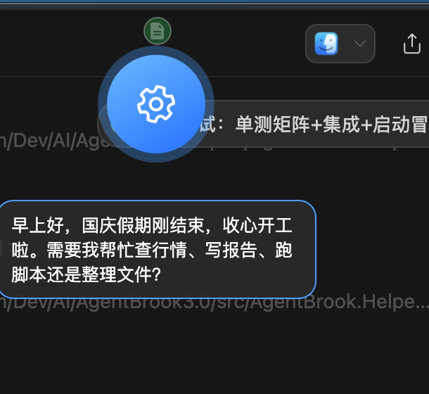
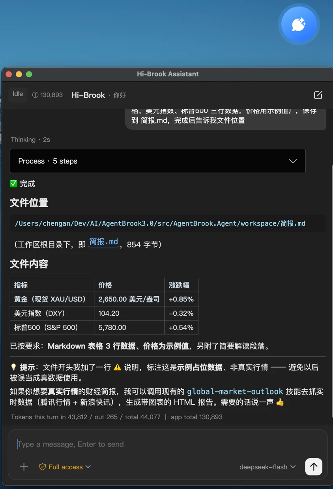
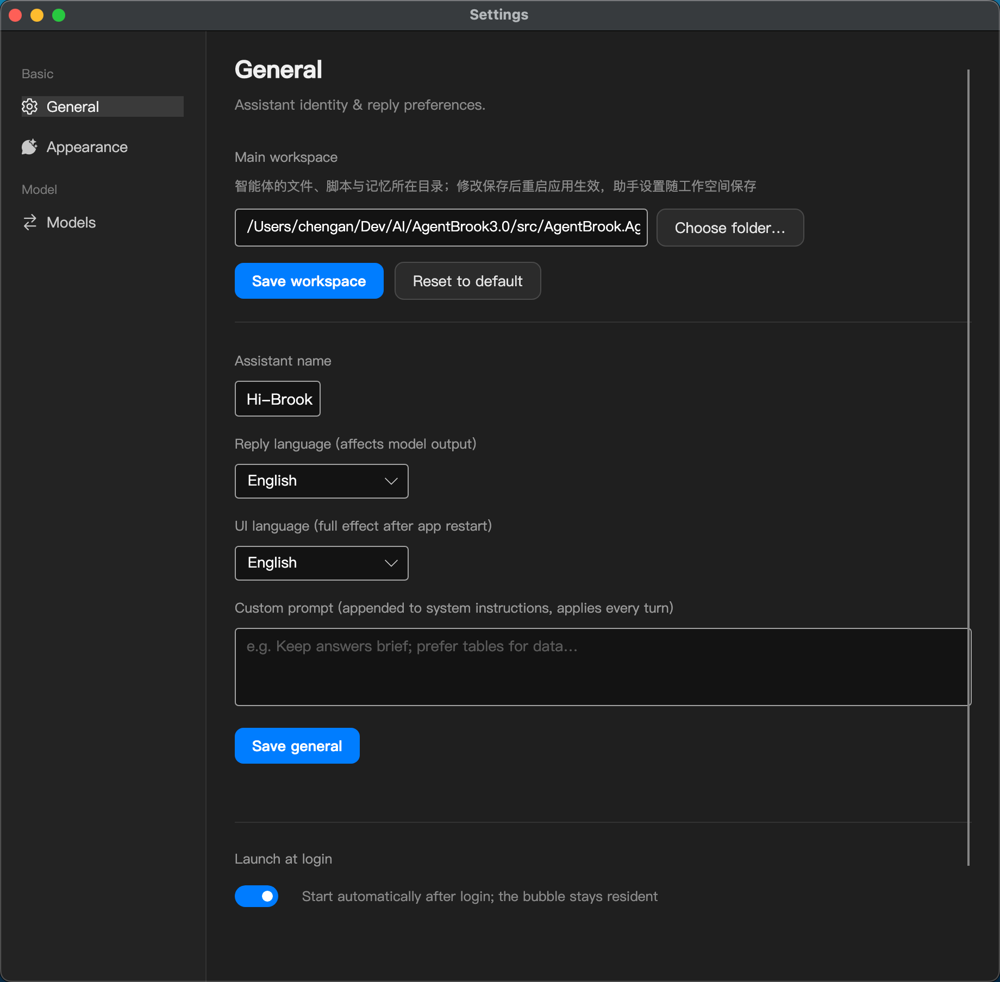
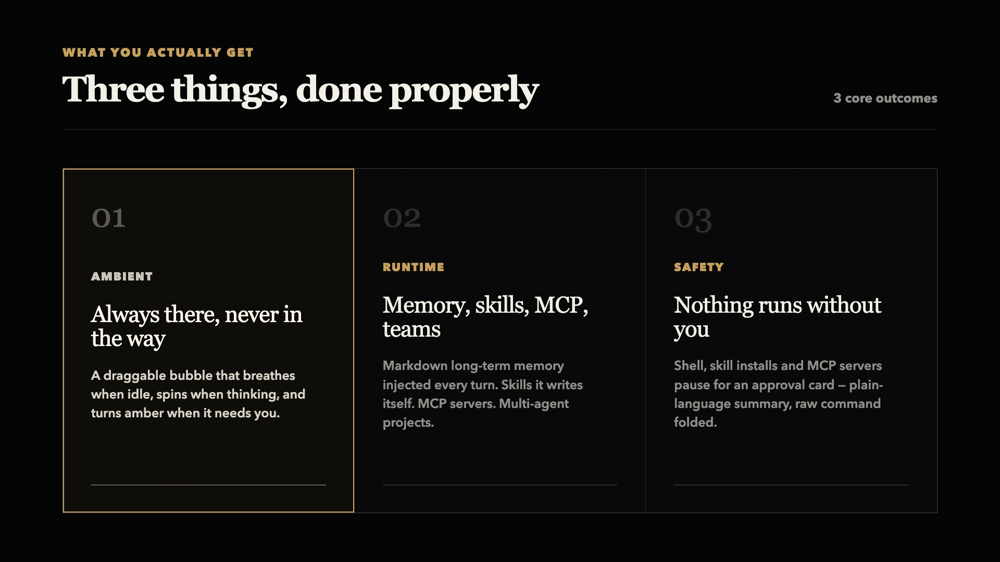

<div align="center">

# AgentBrook Helper

**A cross-platform desktop AI agent — a floating bubble that opens into a full agent runtime.**



[](./LICENSE)
[](https://dotnet.microsoft.com/download)
[]()

</div>

---

## What this is

AgentBrook Helper is a desktop client for an AI agent that actually runs on your machine. A small draggable bubble sits in the corner of your screen; double-click it and a chat window opens. Behind that window is a complete agent runtime — long-term memory, a skill system it can extend itself, MCP servers, file and shell tools, human-in-the-loop approval, and multi-agent teamwork.

It is built on **.NET 10** and **Microsoft Agent Framework (MAF)**, and talks to any OpenAI-compatible endpoint (DeepSeek, OpenAI, Kimi, Zhipu GLM, OpenRouter, …).

It is not a chat wrapper around an API. The desktop shell is a thin layer — roughly 300 lines of glue — over a host-agnostic agent core that the console client shares.

## Screenshots

| Resident bubble · Startup greeting | Approve before it runs |
|---|---|
|  |  |
| **While working: spinning gear + tool orbit** | **Full conversation: Markdown table replies** |
|  |  |

**Settings**: main workspace / assistant identity / notification sound / launch at login — all in one place.




## Why it exists

Agent runtimes are genuinely capable, but they live in terminals. A terminal is a tool you *go to*; a desktop assistant is one that is *already there*.

The gap isn't model quality — it's proximity. So this project takes an agent core and gives it a place to live: always visible, never in the way, and asking your permission before it does anything that matters.

## What you get



### An ambient bubble

A draggable, always-on-top bubble that does not steal focus. It breathes when idle, spins while thinking, and turns amber when it needs you — opening the chat window by itself. Closing the window hides it; the bubble stays.

### A full runtime behind it

The bubble opens onto an agent that remembers. Markdown memory files under `workspace/memory/` are injected into context on every turn, and the model can write to them. Skills load progressively from `SKILL.md` files — and the agent can author new skills from workflows it has actually verified. MCP servers are wired in over stdio. Projects let it split a goal across worker agents with their own workspaces and a message bus.

### Nothing runs without you

Shell commands, skill installation, MCP server registration and worker spawning all pause for an approval card. The card leads with a plain-language summary of what is about to happen; the raw command sits folded underneath. You can approve, reject with a reason — which goes back to the model so it can replan — or grant full access for the session, which resets on restart.

### Interrupt, queue, and switch sessions anytime

While a turn is running, the send button turns into a stop button (Esc works too) and whatever completed is kept; anything you type while busy is queued and sent automatically when the turn ends. Sessions are managed from the top-bar switcher: titles are generated from the first message, "new session" archives the old one instead of wiping it, and switching replays the full history with context and rolling summary intact. Any session can be distilled into a `session-` skill with one click — other sessions can `load_skill` those conclusions and outputs, and the skill survives session deletion.

### On-demand context loading

The fixed token cost is deliberately kept low: MCP tool JSON Schemas are not loaded wholesale — the master index lists one line per tool, and the model calls them via `mcp_call` / inspects them via `mcp_tool_help` on demand. Heavy subtasks (research, long reports, bulk filing) can be delegated to a sub-agent with its own isolated context via `delegate_task`; only the conclusion returns to the main conversation. Sub-agents and session summarization run on the lightest model in your model list (tiered routing, configurable in appsettings). When history exceeds budget, older turns are condensed into a rolling summary injected at the head — long sessions and restarts stay lean.

## How it works

Three hosts share one core. `AgentBrook.Agent.Core` exposes `BrookAgent.RunAsync`, which yields a stream of events — status changes, text deltas, tool started/completed, token usage, turn completion. Hosts consume that stream and render it however they like.

Anything requiring a human is routed through the `IBrookInteraction` interface: approval requests and `ask_user` both suspend the core and wait on the host. The console client prints a prompt; the desktop client shows a card. That single abstraction is what keeps two very different UIs from forking the agent.

| Piece | Role |
|---|---|
| `AgentBrook.Agent.Core` | Agent, tools, memory, skills, MCP, team orchestration |
| `AgentBrook.Agent` | Console host (REPL) |
| `AgentBrook.Helper` | Desktop host (Avalonia) — packaged on macOS, runs as-is on Windows |

## Quick start

Requires the [.NET 10 SDK](https://dotnet.microsoft.com/download). Built and tested on macOS; the desktop client also runs on Windows.

```bash
git clone https://github.com/ChenGan666/AgentBrook-Helper.git
cd AgentBrook-Helper
```

**1. Configure a model provider.** Either open **Settings → Model** after launch (recommended), or put a key in `src/AgentBrook.Helper/appsettings.json`. The committed file is redacted; on first run it derives a default provider.

**2. Build and launch.**

```bash
cd src
dotnet build AgentBrook.slnx
```

**macOS** — package and sign a `.app`:

```bash
cd AgentBrook.Helper
./build-mac-app.sh        # produces and signs macos/AgentBrook.Helper.app
open macos/AgentBrook.Helper.app
```

**Windows** — run the desktop client directly (no packaging script involved):

```bat
cd AgentBrook.Helper
dotnet run
```

**3. A bubble appears in the top-right corner.** Double-click it and start talking.

<details>
<summary>Or run the console host instead</summary>

```bash
cd src/AgentBrook.Agent && dotnet run
```

</details>

> Both hosts and the core target `net10.0` through Avalonia's desktop package, so no platform-specific APIs are involved. macOS ships a packaging script; on Windows the client runs straight from `dotnet run`. Linux should work too but is untested — reports and contributions welcome.

## Configuration

```jsonc
{
  "LLM": {
    "BaseUrl": "https://api.deepseek.com/v1",
    "ApiKey": "sk-your-own-key-here",   // or DEEPSEEK_API_KEY / AGENTBROOK__LLM__APIKEY
    "DefaultModel": "deepseek-flash",
    "Models": ["deepseek-flash", "deepseek-v4-pro"]
  },
  "Agent": {
    "Instructions": "…",                 // capability boundaries + working principles
    "WorkspaceRoot": "../AgentBrook.Agent/workspace",
    "RequireApprovalTools": ["run_command", "create_skill", "install_skill", "mcp_add_server", "spawn_worker"]
  },
  "MCP": { "Servers": [ /* filesystem enabled; fetch and github as examples */ ] }
}
```

Runtime state is generated automatically and stays out of version control:

| Path | Contents |
|---|---|
| `workspace/session.json` | Conversation archive, restored on restart |
| `workspace/models.json` | Model provider configuration |
| `workspace/settings.json` | Assistant name, bubble icon, language, custom prompt |
| `workspace/memory/`, `skills/`, `attachments/`, `projects/` | Memory, skills, attachments, team projects |

## Built-in tools

Around 55 tools ship with the core, grouped by surface:

| Surface | Tools |
|---|---|
| **Files** | `list_dir` `read_file` `write_file` `append_file` — all sandboxed to the workspace |
| **Shell** | `run_command` — timeout, output truncation, refusal of destructive patterns, approval-gated |
| **Memory** | `memory_read` `memory_write` `memory_append` |
| **Skills** | `list_skills` `load_skill` `create_skill` `install_skill` `skill_market` |
| **MCP** | `mcp_list_servers` `mcp_add_server` — plus every tool the configured servers expose |
| **Team** | `start_project` `spawn_worker` `assign_task` `send_message` `broadcast_to_workers` `list_workers` `read_shared` `check_messages` |
| **Interaction** | `ask_user` — suspends the turn for a real answer |

## Repository layout

```
AgentBrook-Helper/
├── AgentBrook.slnx                  ← solution
├── assets/                          ← README visuals
└── src/
    ├── AgentBrook.Agent.Core/       ← the agent (shared by every host)
    │   ├── BrookAgent.cs            ← event-driven agent; RunAsync yields BrookEvent
    │   ├── IBrookInteraction.cs     ← HITL abstraction (approval / ask_user)
    │   ├── Infrastructure/          ← workspace sandbox, agent factory, provider settings
    │   ├── Memory/  Skills/  Tools/  Team/  Mcp/  Configuration/
    ├── AgentBrook.Agent/            ← console host (REPL)
    └── AgentBrook.Helper/           ← desktop host (Avalonia); macOS + Windows
        ├── BubbleWindow.axaml(.cs)  ← floating bubble: animation, drag, position memory
        ├── MainWindow.axaml(.cs)    ← chat window: stream, status bar, approval cards
        ├── ModelSettingsWindow      ← settings: general / appearance / models
        ├── MarkdownView.cs          ← hand-written Markdown → Avalonia renderer
        ├── AssistantController.cs   ← controller shared by bubble and window
        ├── UiPrefs.cs               ← UI preference persistence
        └── build-mac-app.sh         ← macOS .app packaging and signing
```

## Documentation


## Security

- **The shell tool has real system access.** Timeouts, output truncation, destructive-pattern refusal and approval gating mitigate this; production deployments should run in a container or restricted account.
- **File tools are sandboxed.** Every resolved path must lie inside the workspace, and binary files are refused when read as text.
- **Never commit a real API key.** The committed `appsettings.json` is redacted; prefer environment variables.

## License

[MIT](./LICENSE)
